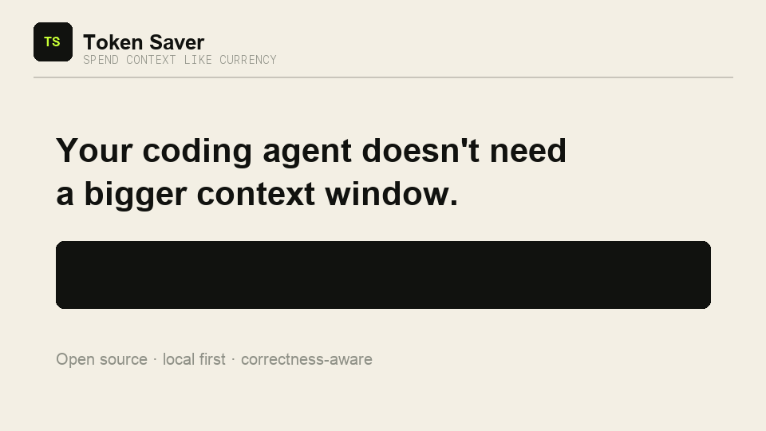

# Token Saver

**Save AI tokens without losing the context that keeps answers correct.**

[Website](https://wenyu0608.github.io/token-saver/) · [Latest release](https://github.com/wenyu0608/token-saver/releases/tag/v0.3.2-alpha.5)

Token Saver gives coding agents a budget brain: it skips overhead on simple tasks, focuses large repositories, documents, and logs, and preserves full evidence when correctness matters. One shared Agent Skills core supports Codex, Claude Code, Cursor, and GitHub Copilot.



Token Saver selects a focused workflow for each task, explains the choice naturally, and ends with an honest `exact`, `estimated`, or `observed-only` token receipt.

Short questions take a Fast Pass: Token Saver skips its Router, Receipt rules, and specialist skills when their overhead would exceed any likely saving.

## Skills

- `$token-saver` automatically routes the task and produces a token receipt.
- `$repomix` builds a compressed map before exploring an unfamiliar repository.
- `$token-audit` measures observable context overhead and ranks fixes.
- `$errors-only` captures full command output locally and returns bounded failures.
- `$diff-context` starts from changed lines and expands only along justified dependencies.
- `$session-handoff` replaces stale chat history with a verified continuation brief.
- `$docs-slice` retrieves bounded, relevant documentation sections.

The umbrella `$token-saver` skill supports automatic selection. The six specialist skills remain explicit so their instructions are not injected into unrelated prompts. The bundled Repomix wrapper uses a compatible local CLI when available or, after explicit approval, retrieves a pinned version with `npx`; no global install is required.

## Install

### Codex

```bash
codex plugin marketplace add wenyu0608/token-saver --ref main
codex plugin add token-saver@token-saver
```

Restart Codex, then invoke a skill such as:

```text
$token-saver diagnose the failing test without dumping the full build log
```

### Claude Code

Run these commands inside Claude Code:

```text
/plugin marketplace add wenyu0608/token-saver
/plugin install token-saver@token-saver
/reload-plugins
```

Then invoke the namespaced skill:

```text
/token-saver:token-saver diagnose the failing test without dumping the full build log
```

See the [Claude Code adapter guide](docs/CLAUDE_CODE.md) for specialist commands,
updates, and local validation.

### Cursor

Add this GitHub plugin directory as a Remote Rule:

```text
https://github.com/wenyu0608/token-saver/tree/main/plugins/token-saver
```

Then invoke `/token-saver`. See the [Cursor adapter guide](docs/CURSOR.md) for
local plugin testing and marketplace distribution.

### GitHub Copilot CLI

```bash
copilot plugin marketplace add wenyu0608/token-saver
copilot plugin install token-saver@token-saver
```

Invoke `/token-saver` in a new session. See the
[GitHub Copilot adapter guide](docs/GITHUB_COPILOT.md).

### Update Codex

Git marketplace installs are cached and do not update live. Refresh the marketplace, reinstall the plugin, then start a new Codex task:

```bash
codex plugin marketplace upgrade token-saver
codex plugin add token-saver@token-saver
```

### Update Claude Code

```text
/plugin marketplace update token-saver
/plugin update token-saver@token-saver
/reload-plugins
```

## Real-world example: understand DreamZero

We asked Token Saver to connect the [DreamZero paper](https://arxiv.org/abs/2602.15922) to its [official implementation](https://github.com/dreamzero0/dreamzero):

```text
$token-saver Read the DreamZero paper and code. Explain how the World Action Model
jointly predicts video and robot actions, then point me to the key implementation files.
```

Token Saver routed the task through two methods:

```text
⚡ Token Saver｜Docs Slice + Repomix：只读架构章节，再画代码地图
```

The resulting explanation followed one evidence trail:

1. Paper pages 6–7 define a causal DiT conditioned on vision, language, and proprioception, trained with joint video-action flow matching.
2. `groot/vla/model/dreamzero/base_vla.py` dispatches joint video-action inference to the action head.
3. `action_head/wan_flow_matching_action_tf.py` coordinates joint denoising, action sampling, and persistent KV caches.
4. `modules/wan_video_dit_action_casual_chunk.py` inserts state/action tokens into the causal DiT and decodes video and action predictions separately.

### Example answer

> DreamZero turns a pretrained video diffusion model into a robot policy by learning video and action in one causal World Action Model. Visual observations are encoded by a VAE, language by a text encoder, and proprioceptive state by a state encoder. The causal DiT processes video, state, and noisy action tokens together; a video head predicts future frames while an action decoder predicts the corresponding action chunk.
>
> Training uses a shared flow-matching objective for video and action instead of training an independent video predictor and inverse-dynamics model. This tight coupling encourages the action prediction to inherit the video backbone's physical and semantic priors, which is the paper's explanation for stronger zero-shot behavior.
>
> During inference, DreamZero generates fixed-size chunks autoregressively. It retains past context in a KV cache, executes predicted actions asynchronously, and replaces predicted visual history with the next real observation. That closed loop limits accumulated video-prediction error while preserving long temporal context.
>
> Start reading the implementation at `base_vla.py`, then follow `joint_video_action` into `wan_flow_matching_action_tf.py`. The shared causal transformer, state/action encoders, action decoder, and KV-cache updates live in `wan_video_dit_action_casual_chunk.py`.

### Measured context funnel

| Context candidate | Tokens |
| --- | ---: |
| Full repository, uncompressed | 337,054 |
| Full repository with `repomix --compress` | 177,239 |
| Task-focused compressed repository map | 54,855 |
| Full 36-page paper, estimated | 42,711 |
| Relevant paper pages 6–7, estimated | 2,243 |

```text
Token Saver 账单｜候选上下文约 379,765 → 57,098 tokens｜估算净节省约 322,667（85.0%）
```

Repository figures are Repomix token counts from DreamZero commit `ab790c1`; the focused scope contains `groot/vla/model/dreamzero/**`, its model configuration, and `README.md`. PDF figures use `ceil(UTF-8 bytes / 4)`, so the combined receipt is labeled as an estimate. The optimized number is a context candidate, not a claim that every token was sent to a model.

For mixed documents, Token Saver captures a lightweight inventory before slicing and keeps visual
pages separate from text estimates:

```text
Token Saver 账单｜文本候选约 X → Y tokens｜图表 A → B 页
```

This inventory is metadata, not a second model request. It prevents the common “processed some
characters, but no comparable baseline” receipt when the original document scope is observable.

For exhaustive debugging, security-sensitive checks, migrations, concurrency, flaky tests, and
other omission-sensitive work, Token Saver switches to **Full Fidelity**. It retains complete
in-scope evidence and compresses only navigation, duplication, and presentation:

```text
🔍 Token Saver｜Full Fidelity：保留完整证据，仅压缩导航与重复内容
Token Saver 账单｜完整证据已保留｜本轮不主张 token 节省
```

## Design

Token Saver optimizes context before it reaches the model. It favors selection over lossy compression, keeps raw diagnostic output locally retrievable, and never edits user configuration without permission.

Routed status lines use the fixed form `⚡ Token Saver｜Docs Slice：只读关键段落`. Receipts use one canonical final-line template for exact, estimated, observed-only, or Full Fidelity results. Small tasks display neither line.

For a short question, Token Saver stays out of the answer and adds only one reminder:

```text
提示：这是简单任务，下次无需启用 Token Saver。
```

See [the MVP contract](docs/MVP.md) for routing, measurement levels, and the baseline model.

## License

MIT
